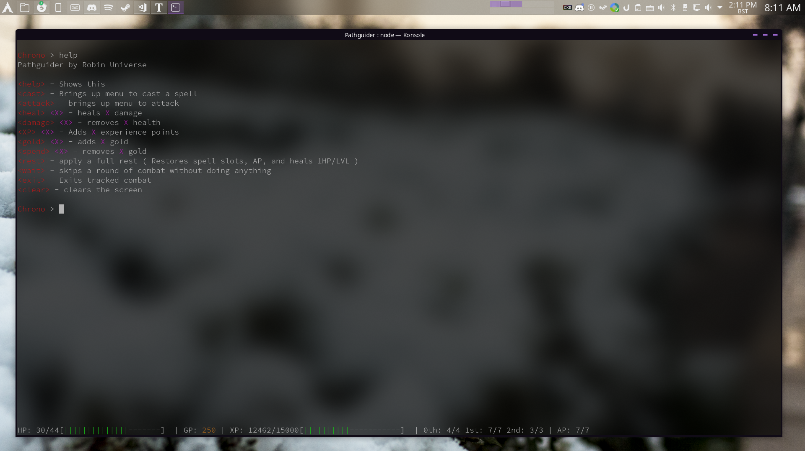

# Pathguider

### A script for keeping track of your pathfinder character

This is a script that I made to keep up with character stats / spell effect and durations while playing pathfinder with my friends instead of marking everything down on pen + paper. I stopped working on this a long time ago, but I figured it would be good to make a repo for it in case someone else may want to try and use it for their character. Currently it's set up to be focused around a Magnus class character, so there are systems to keep track of weapon enchantment bonuses, but I expect you could use this for most normalish class types to some degree

